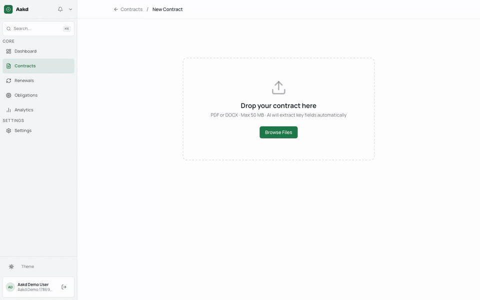
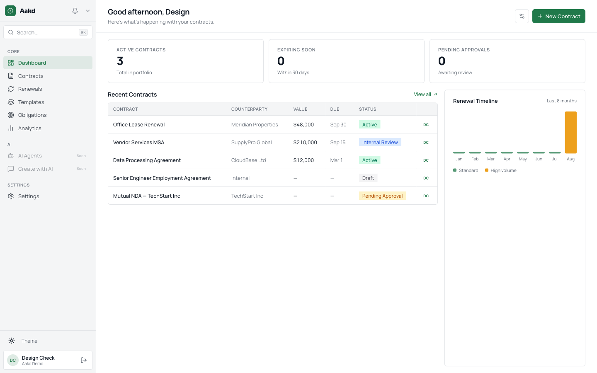
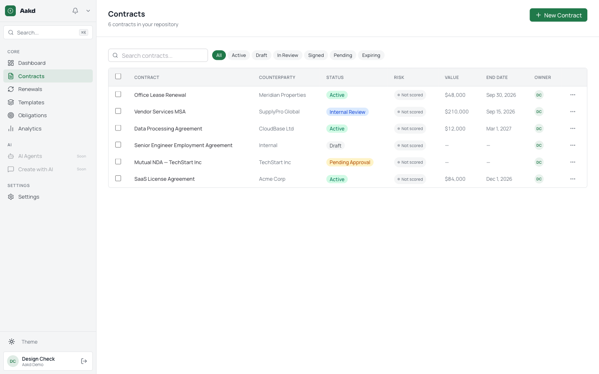

# Aakd

**Turn executed contracts into reviewed, owned actions.**

Aakd is an open-source, self-hostable contract operations workspace. It helps a
team move from an executed PDF or DOCX to cited contract facts, assigned
obligations, deadlines, approvals, and completion evidence.

[](LICENSE)
[](docker-compose.yml)
[](https://www.postgresql.org/)

[Documentation](docs/) · [Roadmap](PRODUCT.md) · [Issues](../../issues) · [Discussions](../../discussions) · [Releases](../../releases) · [Security](SECURITY.md) · [Discord community](https://discord.gg/23hntCVty)

> Aakd is an early open-source release. Customer validation is in progress.
> It is not a hosted service, legal-advice product, compliance certification,
> or autonomous legal agent.

If Aakd is useful to your team, [star the repository](../../stargazers) to help
other self-hosting and contract-operations teams find it.

## The workflow

```text
executed agreement
        ↓
source-linked facts and obligations
        ↓
human review and correction
        ↓
owners, deadlines, approvals, and reminders
        ↓
completion evidence
```

The first useful path is deliberately narrow:

1. Upload an executed PDF or DOCX.
2. Review extracted fields, obligations, and exact source citations.
3. Correct anything that is wrong or missing.
4. Assign owners and due dates.
5. Track follow-up work, renewals, approvals, and evidence of completion.

AI is optional. When enabled, it assists with extraction, questions, risk
signals, and obligation suggestions. AI output remains reviewable and is never
the canonical source of contract truth.

## Demo

This is a real browser recording of the Phase 0 workflow using a disposable
account and a synthetic contract. It shows account setup, contract upload,
human review, and contract creation.



The recording contains no real contract data. The workflow continues after
creation into cited extraction review, obligations, approvals, and reminders.

## What is included today

- Contract repository with PDF/DOCX uploads, OCR, folders, tags, search, and
  version history.
- Source-linked metadata and obligation review with page-level evidence.
- Obligation and renewal views with owners, deadlines, reminders, and audit
  history.
- Organization-scoped approvals, comments, notifications, and activity logs.
- Optional DocuSeal signing integration.
- Optional AI through a provider key or local Ollama deployment.
- REST API and a scoped MCP endpoint for agent-assisted, human-controlled
  workflows.
- English, French, German, Spanish, and Arabic RTL interfaces.

## Intentionally out of scope for the first release

Authoring, template management, autonomous agents, billing, hosted Cloud, and
enterprise identity features are later phases. The code for some of these
surfaces remains in the repository, but they are not part of the Phase 0
promise.

See [`PRODUCT.md`](PRODUCT.md) for the product constitution and [`docs/`](docs/)
for deployment and API documentation.

## Try it locally

### Requirements

- Docker and Docker Compose
- Git
- OpenSSL, for generating local secrets

### Start the complete stack

```bash
git clone https://github.com/aaked-app/aakd.git
cd aakd
cp .env.example .env

# Generate values and put them in .env
openssl rand -base64 32   # BETTER_AUTH_SECRET
openssl rand -hex 32      # ENCRYPTION_KEY
openssl rand -hex 32      # NOTIFICATION_ENCRYPTION_KEY
openssl rand -hex 64      # DOCUSEAL_SECRET_KEY_BASE

docker compose up
```

Open [http://localhost:3000](http://localhost:3000). The first signup creates
an account and organization. Repository, uploads, manual metadata, approvals,
obligations, and signing can be tried without an AI provider. Add an AI key in
Settings only if you want AI-assisted features.

The local stack also includes PostgreSQL, Redis, MinIO, Mailpit, DocuSeal, and
the background worker. Their local endpoints and credentials are documented in
[`docs/self-hosting.md`](docs/self-hosting.md).

## Deploy it yourself

For a single Ubuntu VM, the production installer configures the web app, worker,
PostgreSQL, Redis, S3-compatible storage, DocuSeal, Caddy, and backups:

```bash
git clone https://github.com/aaked-app/aakd.git ~/aakd
cd ~/aakd
chmod +x scripts/*.sh
AAKD_REF=<reviewed-40-character-commit-sha> bash scripts/deploy.sh
```

Point DNS to the server and allow ports 80 and 443 before running the installer.
Email and AI providers are optional. Do not expose the development Compose
stack or its default MinIO/Mailpit credentials to the internet.

```bash
AAKD_REF=<reviewed-40-character-commit-sha> bash scripts/update.sh  # update an installation
bash scripts/doctor.sh                        # diagnose an installation
bash scripts/backup.sh                        # create a database backup
bash scripts/restore.sh backups/file.sql.gz --yes-really-restore
```

Read the complete [self-hosting guide](docs/self-hosting.md) and the
[Oracle Cloud walkthrough](docs/deploy-oracle-cloud.md) before using Aakd with
real contracts.

## Screenshots





## Privacy and AI

Self-hosting keeps application data on infrastructure you control. AI is
opt-in: use Ollama locally or bring your own provider key. Aakd stores the
source text and citation for AI-derived fields so a reviewer can inspect and
correct them.

Do not treat an AI result as legal advice or as an automatic approval. Review
contract facts and obligations before relying on them.

## Architecture

- **Web:** Next.js 14 App Router, React 18, TypeScript, Tailwind CSS
- **Data:** PostgreSQL 16, Prisma, pgvector
- **Auth:** Better Auth with organization-scoped access
- **Jobs:** BullMQ and Redis, with a separate worker process
- **Files:** S3-compatible storage, MinIO in the local stack
- **AI:** Anthropic, OpenAI, or Ollama through the existing provider layer
- **Signing:** DocuSeal integration

The main application lives in `apps/web`. The worker is
`apps/web/worker.ts`. Start with [`CLAUDE.md`](CLAUDE.md) and
[`AGENTS.md`](AGENTS.md) when contributing.

## Verify a release candidate

Run the Phase 0 verification script before publishing a release:

```bash
bash scripts/verify-phase-0.sh
```

This checks Compose configuration, type safety, lint, tests, tenant-isolation
tests, and the production build. It does not claim customer adoption,
enterprise compliance, or production security certification.

## Contributing

Start with an issue or discussion describing the user problem, the affected
workflow, and how it can be verified. Keep changes focused and preserve the
source-linked, human-reviewable contract model. See the repository's issue and
pull-request templates for project-specific guidance.

### Start with a focused contribution

- [Document the synthetic demo-verification workflow](../../issues/12).
- [Write the operator guide to audit history and activity records](../../issues/13).
- [Help shape the amendment-impact review workflow](../../issues/14).

For setup questions, implementation discussions, and contributor coordination,
join the [Aakd Discord community](https://discord.gg/23hntCVty). Please avoid
sharing real contract data or other confidential information in public channels.

To share evaluation feedback without including confidential contract data,
[open a workflow-feedback issue](../../issues/new?template=workflow_feedback.md).

For security vulnerabilities, use the private reporting process in
[`SECURITY.md`](SECURITY.md) rather than publishing exploit details in an issue.

## Documentation

- [Product constitution and roadmap](PRODUCT.md)
- [Self-hosting guide](docs/self-hosting.md)
- [API reference](docs/api-reference.md)
- [Community launch checklist](docs/community-launch-checklist.md)

## License

Aakd is licensed under [AGPL-3.0](LICENSE). Commercial licensing is available
for white-labeling or SaaS redistribution.
